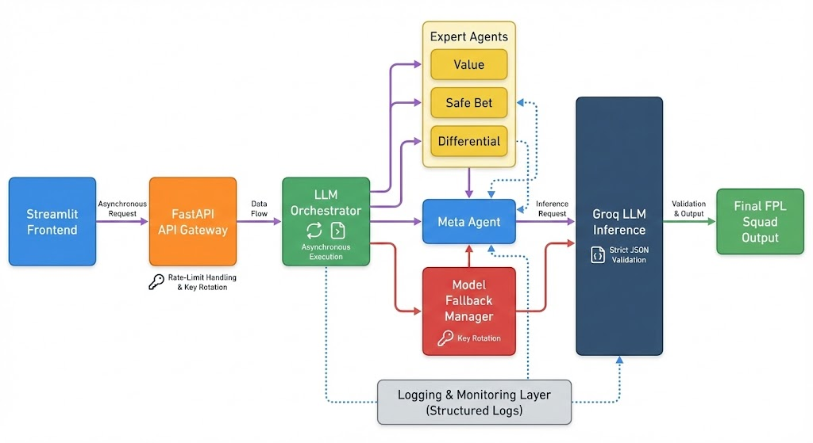

# Probabilistic Pundit

### A Multi-Agent LLM System for Fantasy Premier League Decision Support

Probabilistic Pundit is an AI-powered system that generates optimized Fantasy Premier League (FPL) squads using a combination of deterministic ranking algorithms and multi-agent Large Language Model reasoning.
The project integrates a FastAPI backend, Streamlit frontend, and a production-oriented MLOps pipeline to ensure reliable, explainable, and high-performance team recommendations.

---

## Overview

FPL squad selection is a constrained optimisation problem involving a fixed budget, formation rules, and club limits.
This system addresses these constraints using a three-stage pipeline:

1. *Candidate Selection (TOPSIS)*
   Aggregates player performance data and applies the TOPSIS ranking algorithm to select the top 30 most relevant players for analysis.

2. *Expert LLM Agents (Parallel Evaluation)*
   Three distinct LLM personas independently evaluate players:

   * Value Hunter
   * Safe Bet
   * Differentials Specialist
     Each agent assigns probabilistic performance outcomes and short justifications.

3. *Meta-Agent Synthesis*
   Combines expert evaluations, applies consensus rules, and constructs the final 15-player squad under all FPL constraints.
   A deterministic fallback ensures a valid squad is always produced.

  

---

## Key Features

* TOPSIS-based pre-filtering of player pool
* Parallel multi-agent reasoning with structured JSON outputs
* Meta-agent for constrained squad construction
* Deterministic fallback for guaranteed validity
* Fully asynchronous FastAPI backend
* Streamlit UI for interactive squad generation
* Robust logging and error handling with API key rotation and model fallback

---

## Repository Structure

backend/
  app/
    agents/
    api.py
    orchestrator.py
    llm_client.py
    data_loader.py
    topsis_filter.py
frontend/
  streamlit_app.py
data/
docs/

---

## Installation

### 1. Create virtual environment

bash
python3 -m venv .venv
source .venv/bin/activate
pip install -r requirements.txt

### 2. Configure environment variables in .env

EXPERT_DEFAULT_MODEL=llama-3.1-8b-instant
META_DEFAULT_MODEL=llama-3.1-8b-instant

GROQ_API_KEY=<primary>
GROQ_API_KEY_2=<secondary>

LLM_MAX_CONCURRENCY=8
EXPERT_CHUNK_SIZE=30

---

## Running the System

### Backend (FastAPI)

bash
cd backend
uvicorn app.main:app --reload --port 8000

### Frontend (Streamlit)

bash
cd frontend
streamlit run streamlit_app.py

---

## Deployment

The system is deployed on an Ubuntu server.
Backend and frontend run as independent services:

* FastAPI (ASGI via Uvicorn)
* Streamlit dashboard for interaction

All inference is routed through the Groq API with model fallback and key rotation for reliability.

---

## Contact

*Mehul Agarwal*  
mehul22294@iiitd.ac.in

*Rahul Ramesh Omalur*  
rahul22392@iiitd.ac.in

---